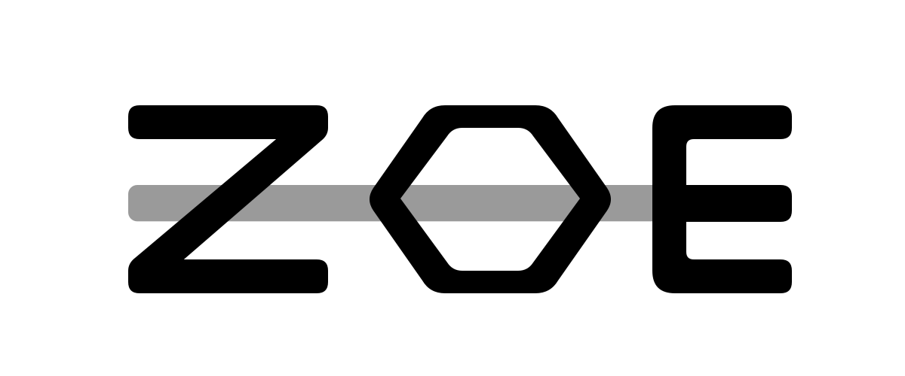

  

# ZOE SDLC

A way of running a software project using agentic skills. Humans act
as 'directors', while the agents manage everything else.

ZOE SDLC is a template ZOE (Zero Organisation Enterprise) — a set of skills and
instructions designed to work alongside the
[ZOE kernel](https://github.com/stainsby/zoe-kernel) and be extended
for your software project. It is designed to create projects that audit
and improve themselves autonomously.

Current version: see [`VERSION`](base/VERSION). What changed in each release: see
[`CHANGELOG.md`](CHANGELOG.md).

## What is in it

One instructions file — [`zoe-sdlc.instructions.md`](base/instructions/zoe-sdlc.instructions.md),
carrying the rules that apply across everything — and ten skills:

| Skill | What it covers |
|---|---|
| [`zoe-sdlc-adopt`](base/skills/zoe-sdlc-adopt/SKILL.md) | bringing a project — new or existing — under this process |
| [`zoe-sdlc-components`](base/skills/zoe-sdlc-components/SKILL.md) | breaking a system into components and capabilities, and naming them |
| [`zoe-sdlc-tasks`](base/skills/zoe-sdlc-tasks/SKILL.md) | what every task has to record |
| [`zoe-sdlc-sequencing`](base/skills/zoe-sdlc-sequencing/SKILL.md) | the order every change follows, and what "complete" means |
| [`zoe-sdlc-templates`](base/skills/zoe-sdlc-templates/SKILL.md) | what a template is here, and how to use one |
| [`zoe-sdlc-stories`](base/skills/zoe-sdlc-stories/SKILL.md) | writing down what someone wants, in their words |
| [`zoe-sdlc-specify`](base/skills/zoe-sdlc-specify/SKILL.md) | writing a component's specification |
| [`zoe-sdlc-develop`](base/skills/zoe-sdlc-develop/SKILL.md) | running a piece of implementation work |
| [`zoe-sdlc-fix`](base/skills/zoe-sdlc-fix/SKILL.md) | fixing a defect |
| [`zoe-sdlc-audits`](base/skills/zoe-sdlc-audits/SKILL.md) | the four checks that keep intent, documents and software in line |

## How to use

Point your AI host at this base — the
[instructions file](base/instructions/zoe-sdlc.instructions.md) and the skills under
[`skills/`](base/skills/) — alongside the ZOE kernel, and ask it how to proceed. It starts with `zoe-sdlc-adopt`, which
extends the kernel's own setup: with you present, it settles the handful of decisions this
process needs from your project — where tasks live, how things are named, how tests are
run, and so on. From there, the cycle takes over.

Alternatively, get your AI to read *this* file and help you wire in the instructions and
skills.

## What this is not

It does not prescribe files, paths or formats. It says what has to be true, and leaves your
project to decide the shape. It is meant to work whether your work is tracked in Jira,
GitHub Issues or plain files, and whatever your repository looks like.

## Changing it

The instructions and skill files here are intended to be read-only to you.
Instead, agents specialise your project by adding more skills alongside these.
Improvements to the base itself travel back upstream, so that everyone running
it gets the fix.

## Where it came from

ZOE SDLC is the successor to the [PAPI Skills](https://github.com/stainsby/papi) project,
whose process ideas it generalises.
